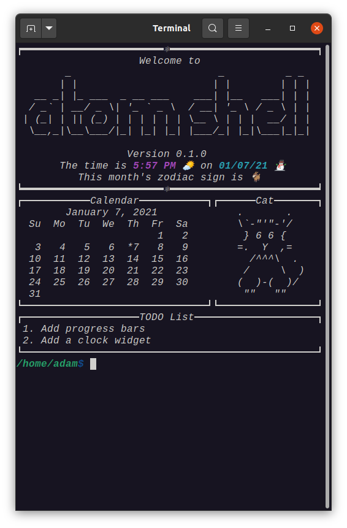
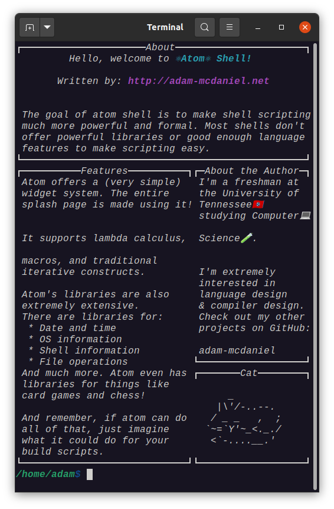

# atom

Shell scripting that will knock your socks off.

<p float="left">
  <a href="https://asciinema.org/a/383254"></a>
  <a href="https://asciinema.org/a/383254"></a>
</p>
(https://asciinema.org/a/383254)

##### _NOTE: Click the image above for a video demonstration._

# Why write a shell?

[Bash](https://en.wikipedia.org/wiki/Bash_(Unix_shell)) is everywhere in the programming world. Literally _everywhere_. If you download and install this project, you will likely use bash to do so **(or some bash derivative / compatible shell)**.

Typically, I _**love**_ it when a small, simple platform like bash is extremely widespread. It usually makes everyone's lives easier to use.

**_Usually._**

### Bash scripting needs to be outlawed

Seriously, _how do people actually write bash scripts_??? It's absolutely [unusable](https://mywiki.wooledge.org/BashPitfalls) for the vast majority of people who aren't absolute-200-IQ-geniuses. Everytime I want to do a _simple `for` loop_ over each files in a directory, I have to look it up, and then **still** give up because it's too difficult.

How can users be expected to write code like this?

```bash
shopt -s nullglob
for path in ./*; do
    [[ ${path##*/} != *.* ]] && rm "$path"
done
```

Or code like this??

```bash
oIFS=${IFS+_${IFS}}
IFS=/; echo "${array[*]}"
${oIFS:+'false'} unset -v IFS || IFS=${oIFS#_}
```

The answer: _they can't._

### What is the core reason behind bash scripting being terrible?

The worst parts about bash's scripting capabilities are as follows:
1. Bash code is designed to be hacked together quickly in an unreadable way, which is not a good design goal for _scripting_ features. While commands meant for typical file navigation and running programs should be quick and simple, _scripting features should be more readable and consistent._
2. Bash _**still** fails to be hacked together quickly in an unreadable way_.


