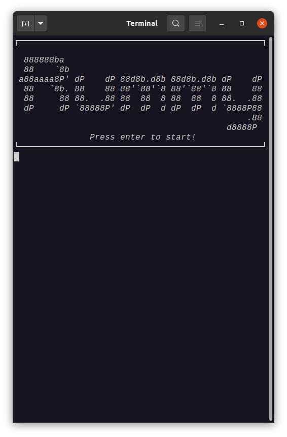
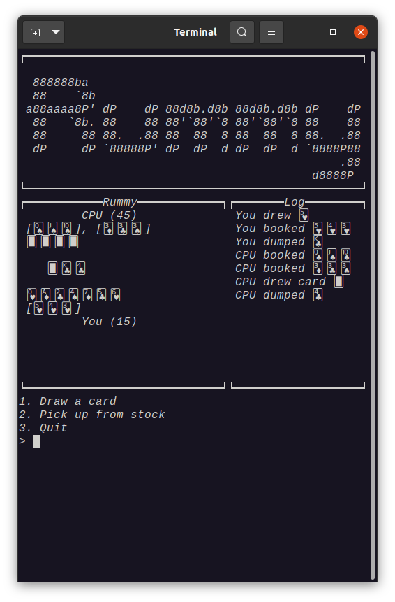

# atom

Shell scripting that will knock your socks off.

<p float="left">
  <a href="https://asciinema.org/a/383254"></a>
  <a href="https://asciinema.org/a/383254"></a>
</p>

##### _NOTE: Click the image above for a video demonstration._

## About the Author

I'm a freshman in college bored in quarantine, and looking for any work. If you enjoy my projects, consider supporting me by buying me a coffee! 

<a href="https://www.buymeacoffee.com/adammcdaniel" target="_blank"></a>

## Why write a shell?

[Bash](https://en.wikipedia.org/wiki/Bash_(Unix_shell)) is everywhere in the programming world. Literally _everywhere_. If you download and install this project, you will likely use bash to do so _(or some bash derivative / compatible shell)_.

Typically, I _**love**_ it when a small, simple platform like bash is extremely widespread. It usually makes everyone's lives easier to use.

**_Usually._**

### Bash scripting needs to be outlawed

Seriously, _how do people actually write bash scripts_??? It's absolutely [unusable](https://mywiki.wooledge.org/BashPitfalls) for the vast majority of us who aren't absolute-200-IQ-geniuses. Everytime I want to do a _simple `for` loop_ over each files in a directory, I have to look it up, and then **still** give up because it's too difficult.

How can users be expected to write code like this?

```bash
shopt -s nullglob
for path in ./*; do
    [[ ${path##*/} != *.* ]] && rm "$path"
done
```

Or code like this??

```bash
oIFS=${IFS+_${IFS}}
IFS=/; echo "${array[*]}"
${oIFS:+'false'} unset -v IFS || IFS=${oIFS#_}
```

The answer: _they can't._

### What is the core reason behind bash scripting being terrible?

The worst parts about bash's scripting capabilities are as follows:
1. Bash code is designed to be hacked together quickly in an unreadable way, which is not a good design goal for _scripting_ features. While commands meant for typical file navigation and running programs should be quick and simple, _scripting features should be more readable and consistent._
2. Bash fails to even fulfill its **_one_** design goal, because scripts are _so_ unreadable that it's **impossible** to hack anything together at all.

### How does atom address these problems?

As I see it, there are two sides of a shell. The interactive side, and the scripting side. Creating a _**good**_ shell means balancing these two modes well. If you make a language too well suited to _scripting_, then file navigation, and other interactive features will suffer. On the other hand, if you make a language too well suited for _interactive_ commands **(like bash)**, then scripting becomes impossible.

Atom tries to strike a better balance between the two modes, and, in my opinion, does so rather successfully. It does seem to be more well suited to scripting instead of interactive programming, but I don't really mind the sacrifice all that much.

Atom's design goals are:
1. Shell scripting _must_ be powerful enough to function as a traditional high level language.
2. At the same time, there must not be a lot of syntactic sugar for writing _interactive_ commands.
3. **Incorrect code should be rejected**. There should be no attempt to understand the user's incorrect code **(see [JavaScript](https://javascript.com))**. _Bad code is bad code_.
4. Declarative and functional programming first, **imperative last**.

I would say these goals serve atom very well.

To show Atom's scripting capabilities, I wrote an entire card game using it!

<p float="left">
  <a href="https://asciinema.org/a/383254"></a>
  <a href="https://asciinema.org/a/383254"></a>
</p>

The CPU is actually much better than I am, and has beaten me with twice or thrice my score multiple times. It doesn't cheat at all, it only ranks its cards by synergy, encourages picking up cards that synergize well with its best cards, and discarding its worst cards.

If you want to try all of my custom macros, and to have my splash screen, use my `.atom-prelude` file in your home directory and experiment away! To play my card game specifically, run `rummy@play'`.

## Usage

Atom is drastically different than any other shell, both with its outward syntax and internal functionality.

For example, atom supports traditional tables, lists, strings, ints, floats, bools, etc. like [this drastically better and more professional shell that I should have just started using to begin with (but there's no fun in that. "Not invented here syndrome" really does have a hold on me doesn't it?)](https://www.nushell.sh/).

But atom also takes direct inspiration from languages like [lisp](https://en.wikipedia.org/wiki/Lisp_(programming_language)) by including symbols as first class types, and by implementing iterative constructs like `for` and `while` loops as _values_, not operations on values.

Additionally, it adds lambdas (which can capture their environment), and macros (which can change their parent environment).

### Interactive Syntax

While this syntax will work in all of your scripts as valid statements, my intent is for this to be mainly used for interactive programming.

Generally, executing programs (and functions too) in atom and in bash is only different by one character.

Bash:
```bash
$ g++ main.cpp -o main
```

Atom:
```
$ g++' main.cpp -o main
```

You might be thinking that writing a quote after every program name is not so ergonomic, but it actually isn't half bad. I find now that when I use bash, I can't seem to type any commands _without_ it accidentally.

The reason I chose the `'` character is because it is the most readily available character that isn't used in any symbols (besides the semicolon) that is also _not_ accessed with the shift key. The command `g++' main.cpp -o main` really is just one extra keystroke.

Not that much of a sacrifice for scripting power bestowed by the gods.

#### Aliases

You might find that you have defined a symbol `g++` with a non-callable value (not a macro or a function), like `5`.

If this is the case, simply wrap the symbol `g++` in quotes,
and then run it like so: `"g++"' main.cpp -o main`.

This also means that you can make aliases rather simply by defining a symbol with a string or a path.

This snippet defines `ls` as an alias for the [`lsd`](https://github.com/Peltoche/lsd) program:
```python
ls := "lsd";
ls'
```

### Scripting Syntax

Again, scripting syntax is really just syntax encouraged for scripting. All syntax you see on this README will work anywhere.

To start off simple, let's define a variable.

```python
x := 5;
```

Wow! We've changed our environment! This means that whenever the symbol `x` is evaluated, it becomes `5` instead!

Now let's define something else.

```python
WEEKDAYS := [
	"Sunday",
	"Monday",
	"Tuesday",
	"Wednesday",
	"Thursday",
	"Friday",
	"Saturday"
];

grades := {
    "adam": 50,
    "literally everyone else": 100
};
```

Bravo! Now the symbol `WEEKDAYS` is bound to a list containing all the weekdays' names, and the symbol `grades` is bound to a table containing grades for students!

Now let's try to do some fun stuff with lambdas.

```haskell
min := \x,y -> x < y? x : y;
max := fn(x, y) -> x > y? x : y;

# You can put brackets around the lambda body for multiple statements
return-five :=   () -> { print("returning 5"); 5 };
return-six  := fn() -> 6;

increment := x -> x + 1;
decrement := fn(x) -> x - 1;
```

As you can see, we can use the `\... -> ` or `fn(...) -> ` syntactic sugar to create lambda functions with multiple arguments, `() -> ` to create a lambda that takes no arguments, or just a symbol and an arrow to create a lambda that takes a single argument. How handy!

You can also use the `fn` keyword to define functions without assigning them.

```rust
fn is-leapyear(year) {
	if year % 4 = 0 and year % 100 != 0 {
		true
	} else if year % 100 = 0 and year % 400 = 0 {
		true
	} else {
		false
	}
};

fn days-in-month(month, year) {
	month = 2? 28 + to-int(is-leapyear(year)) : 31 - (((month - 1) % 7) % 2)
};

fn day-of-week(m, d, y) {
	t := [0, 3, 2, 5, 0, 3, 5, 1, 4, 6, 2, 4];

    # Notice that semicolons go on the end of if statements too
	if m < 3 { y := y - 1 };
    
    # The last expression in a function is the value that is returned
	(((y + to-int(y / 4)) - to-int(y / 100)) + to-int(y / 400) + t[m - 1] + d) % 7
};
```

Please note the semicolon at the end of _every expression_. It is required for everything except for the last value of a block!

You can also define macros in a similar manner with the `macro` keyword:

```rust
# We write `; nil` at the end of the macro so that
# the macro returns nil, instead of the new CWD value.
root := macro() -> { CWD := ROOT; nil };

macro quit() {
	print("Goodbye!👋");
	sleep(0.4);
	exit();
};
```

Isn't this nice???

### Functions vs. Macros

Functions and macros look very similar, and perform almost identical tasks, but they have drastically different implications.

To explain it simply, a function creates its own local scope, with local variables that are dropped when the function returns. Macros, however, use the _current scope that the macro is called in_ as its scope.

Variables that would have been overwritten by the macro's parameters, are saved. Take the following code for example:

```rust
x := 5;
y := nil;
macro test(x) { y := x };

print(x, y);
test("x is still 5, but y is not nil");
print(x, y);
```

Macros let you read and write global state, while (user defined) functions have no side effects on the global state of the program.

Builtin functions are a different beast entirely, though...

### Builtin Functions vs. Functions

Builtin functions are a bit of a misnomer. They're half macro, half function, and a little bit of something else not quite quantifiable. How do they work? The world may never know.

The reason they're so mystical is because _they can change the scope they were called in (like macros), they have the option to not evaluate their arguments (unlike macros), and they can take varying numbers of arguments._. For example, take the `cd` builtin function. Not only does it _not_ evaluate its arguments (calling `cd` with `Desktop` doesn't evaluate the symbol `Desktop`), it modifies the `CWD` variable in the current scope. How weird is that?

```python
$ home'
$ cd' Desktop
```

Additionally, builtin functions like `echo`, `print`, and `to-str` can take varying numbers of arguments.

```python
$ print("x is equal to", x := 5, "and y is equal to", y := 6)
```

Although these features of builtin functions are cool and bizarre, they really aren't used in many instances. _**Functions like `print` and `cd` are exceptions to the rule**_, and you can expect most functions to behave _exactly_ as regular user defined functions without any bizarre catches.

## Modules

Atom has an extensive list of builtin libraries (for a shell written in a week or so, that is). Here's a list of builtin modules.

Modules (which is just a fancy name for tables intended to function as libraries), can be accessed with the `@member` operator or the `["member"]` operators.

Example usage:
```python
shuffled-deck := rand@shuffle(cards@deck@all);
echo(shuffled-deck[0]);
```

| Module | Description | Members |
|-|-|-|
| `rand` | A module embodied with chaos. Use your power of entropy wisely, young scripters. | `{ int: fn(int, int) -> int, shuffle: fn([any]) -> [any], choose: fn([any]) -> any }` |
| `fmt` | A module for formatting strings. As of right now, there are only functions that manipulate color, boldness, underlining, etc. | `{ red: fn(str) -> str, green: fn(str) -> str, blue: fn(str) -> str, yellow: fn(str) -> str, magenta: fn(str) -> str, cyan: fn(str) -> str, black: fn(str) -> str, gray: fn(str) -> str,grey: fn(str) -> str,white: fn(str) -> str, dark: { red: fn(str) -> str, green: fn(str) -> str, blue: fn(str) -> str, cyan: fn(str) -> str, yellow: fn(str) -> str, magenta: fn(str) -> str, }, bold: fn(str) -> str, invert: fn(str) -> str, underline: fn(str) -> str }` |
| `widget` | A small module for creating widgets for displaying text in the terminal. Widgets have a title, a content string, a width, and a height. | `{ create: fn(str, str, int, int) -> str,add-horizontal: fn(str...) -> str,add-vertical: fn(str...) -> str }` |
| `math` | A module for various math functions. Trigonometry, multiple logarithms, etc. | `{ E: float, PI: float, TAU: float, pow: fn(float, float) -> float, log: fn(float, float) -> float, log10: fn(float) -> float, log2: fn(float) -> float, sqrt: fn(float) -> float, cbrt: fn(float) -> float,sin: fn(float) -> float, cos: fn(float) -> float, tan: fn(float) -> float,asin: fn(float) -> float, acos: fn(float) -> float, atan: fn(float) -> float }` |
| `os` | A small module for getting info about the operating system. Useful for creating cross-platform scripts. | `{ name: str,  family: str, version: str }` |
| `sh` | A small module for getting info about the shell, such as the version, the path to the executable, the executable's parent directory, and the path the to prelude script (the script run at the shell's startup, like `.bashrc`).  The `version` member contains the major, minor, and patch integers. | `{ exe: path, dir: path, version: [int],  prelude: path }` |
| `file` | A small module for file manipulation. It's not much yet. Keep it simple. | `{ read: fn(path or str or sym) -> str, write: fn(path or str or sym, str) -> nil, append: fn(path or str or sym, str) -> nil }` |
| `date` | The date module is a bit weird. It's not so much a module, more of a hidden function. Every time `date` is accessed, it uses a constantly updating table with the current date info, and the date as a string. | `{ day: int, weekday: int, month: int, year: int, str: str }` |
| `time` | The time module functions just like the date module, but for time. My favorite thing so far about this module is writing macros that print fake and bizarre `g++` errors if the user tries to compile on the first second of the minute. Purely evil stuff waiting to happen, this module is. | `{ hour: int, minute: int, hour: int, str: str }` |
| `cards` | A module for card games. Cards are just strings with their respective Unicode representation. So, for example, the value `cards@deck@aces[0]` is `"🂡"`. In every list containing multiple suites in the module, they alternate between Spades, Hearts, Diamonds, Clubs. So, `cards@deck@all` is `["🂡", "🂱", "🃁", "🃑", "🂢", ..., "🃞"]`.       | `{ deck: { all: [str], aces: [str],  kings: [str], queens: [str],  jacks: [str], faces: [str],  numbers: [str] }, suites: {  spades: str, clubs: str,  hearts: str, diamonds: str },  suite: fn(str) -> str,  value: fn(str) -> int,  name: fn(str) -> str,  from-name: fn(str) -> str,  back: str }` |
| `chess` | A module for chess. Chess boards are stored as lists of rows, which are lists of pieces. Pieces, similar to cards, are just strings with their respective Unicode representation. So, `cards@white@king` is `"♔"`, and `cards@black@king` is `"♚"`. | `{ white: { king: str, queen: str,  rook: str, bishop: str, knight: str,  pawn: str }, black: { king: str, queen: str,  rook: str, bishop: str, knight: str,  pawn: str }, space: str, is-piece: fn(str) -> bool, is-space: fn(str) -> bool, is-white: fn(str) -> bool, is-black: fn(str) -> bool, create: fn() -> [[str]], flip: fn([[str]]) -> [[str]], get: fn([[str]], str) -> str, fmt: fn([[str]]) -> str, print: fn([[str]]) -> nil, mv: fn([[str]], str, str) -> [[str]], add: fn([[str]], str, str) -> [[str]], rm: fn([[str]], str) -> [[str]] }` |

These are all intended to make scripting extremely ergonomic. With builtin libraries for a wide variety of tasks, making scripts will be incredibly easy.

We bring the blocks, you bring the glue.

## Constants and Builtin Functions

These constants and builtin functions are intended to be used extremely often in scripting and in the interactive prompt, so they are all included in the global scope.

They can all be overwritten, if you wish. I would be careful about using macros to assign to these values! Be _absolutely sure_ that your code won't break something before you run it!

| Name | Description | Type | Value |
|:-:|:-:|:-:|:-:|
| `nil` or `()` | The atom equivalent of python's `None` | `nil` | `nil` |
| `true` and `truth` | The boolean value for true. | `bool` | `true` |
| `false` | The boolean value for false. | `bool` | `false` |
| `CWD` | The path of the current working directory. | `path` | See description. |
| `HOME` | The path of the home directory. | ^ | ^ |
| `VIDS` | The path of the videos directory. | ^ | ^ |
| `DESK` | The path of the desktop directory. | ^ | ^ |
| `PICS` | The path of the pictures directory. | ^ | ^ |
| `DOCS` | The path of the documents directory. | ^ | ^ |
| `DOWN` | The path of the downloads directory. | ^ | ^ |
| `report` | The function that's called to print the result of a command. This can be written to format results in a custom way, or to not print nil values | `fn(any) -> nil` | By default, `fn(val) -> print(" =>", val)` |
| `prompt` | The function used to generate the prompt for the user to enter commands on. It takes the current working directory as a parameter. | `fn(path) -> str` | By default, `fn(cwd) -> to-str(cwd) + "> "` |
| `incomplete-prompt` | The function used to generate the prompt for the user to enter commands on after they've entered an incomplete line of code. It takes the current working directory as a parameter. | ^ | By default,  `fn(cwd) -> " " * len(cwd) + "> "` |
| `absolute` | This function takes a path, removes any extraneous portions of the path (such as `foo/../bar`), and also makes the path an absolute path. So `./testing` in the home directory would become `/home/adam/testing`, for example. | `fn(path) -> path`  or `fn(sym) -> path` or `fn(str) -> path` | Native code. |
| `exists` | This function returns whether or not any path exists. | `fn(path) -> bool` or `fn(sym) -> bool` or `fn(str) -> bool` | ^ |
| `is-err` | This function returns whether or not the evaluation of the inner expression returns an error. | `fn(any) -> bool` | ^ |
| `is-syntax-err` | This function returns whether or not an error is a syntax error. This is mainly intended for use with the `report` function. | `fn(any) -> bool` | ^ |
| `sleep` | Make the shell pause for a given number of seconds. | `fn(float) -> nil` | ^ |
| `to-path` | Convert a string or symbol to a path. | `fn(path or str or sym) -> path` | ^ |
| `to-float` | Convert a string, integer, float, or boolean to a floating point value. | `fn(str or int or float or bool) -> float` | ^ |
| `to-int` | Convert a string, integer, float, or boolean to an integer. | `fn(str or int or float or bool) -> int` | ^ |
| `input` | Get user input with a prompt. | `fn(any...) -> str` | ^ |
| `rev` | Reverse a string or a list. | `fn(str) -> str or fn([any]) -> [any]` | ^ |
| `split` | Split a string with a given delimiter. | `fn(str, str) -> str` | ^ |
| `sort` | Sort a list of integers. | `fn([int]) -> [int]` | ^ |
| `join` | Join a list with a separator. | `fn([any], any) -> str` | ^ |
| `env` | A table containing all bindings in scope. | `macro() -> table` | ^ |
| `HOME`, `VIDS`, `DESK`, `PICS`, `DOCS`, `DOWN` | The path to the respective directory. | `path` | ^ |
| `home`, `vids`, `desk`, `pics`, `docs`, `down` | Macros that set the current working directory to the respective directory. | `macro() -> nil` | `macro() -> CWD := ...` |
| `exit` or `quit` | Exit the current shell session. | `fn() -> nil` | Native code. |
| `unbind` | Unbind a symbol with a given name. | `macro(str) -> nil` | ^ |
| `print` | Print one or more values, and return the last one. | `fn(any...) -> any` | ^ |
| `echo` | Print one or more values, and return `nil`. | `fn(any...) -> nil` | ^ |
| `pwd` or `cwd` | Print the current working directory. | `macro(path or string or sym) -> nil` | ^ |
| `cd` | Change the directory. This macro is a special form, _it does not evaluate its argument_. For example, if `x` is defined as `5`, `cd' x` will **NOT** perform `cd' 5`, it will perform `cd' "x"`. | `macro(path or string or sym) -> nil` | ^ |
| `cd-eval` | Change the directory to an evaluated value. This is used when you want to `cd` into a folder with an unknown name while writing the script. | `macro(any) -> nil` | ^ |
| `clear` or `cls` | Clear the console. | `fn() -> nil` | `fn() -> { if os@family = "linux" or os@family = "unix" { clear' } else if os@family = "windows" { cls' } else { print("\n" * 255) } }` |
| `keys` | Get the list of keys in a table. | `fn(table) -> [str]` | Native code. |
| `vals` | Get the list of values in a table. | `fn(table) -> [any]` | ^ |
| `insert` | Return a table with a value inserted with a given key. | `fn(table, str, any) -> table` | ^ |
| `remove` | Return a table with a value removed with a given key. | `fn(table, str) -> table` | ^ |
| `len` | Get the length of a list or string, the number of pairs in a table, or the number of components to a path. | `fn([any] or table or str or path) -> int` | ^ |
| `push` | Add a given element to a list. | `fn([any], any) -> [any]` | ^ |
| `pop` | Return the last element of a list. | `fn([any]) -> any` | ^ |
| `zip` | Zip two lists together. This creates a list of pairs (lists of length two), with each pair containing an element of the first list and an element of the second list. | `fn([any], [any]) -> [[any, any]]` | ^ |
| `head` | Get the first element of a list. | `fn([any]) -> any` | `fn(list) -> list[0]` |
| `tail` | Get the list without the first element. | `fn([any]) -> [any]` | Native code. |
| `map` | Map a function over a list. | `fn(fn(any) -> any, [any]) -> [any]` | `fn(f, list) -> { result := []; for x in list { result := push(result, f(x)); }; result }` |
| `filter` | Filter a list with a given function. | `fn(fn(any) -> bool, [any]) -> [any]` | `fn(f, list) -> { result := []; for x in list { if f(x) { result := push(result, x); }; }; result }` |
| `reduce` | Reduce a list to an atomic value with a function that takes an accumulator and an element of the list, and returns the new accumulator.  Reduce takes three arguments, the function, the initial value of the accumulator, and the list to reduce. | `fn(fn(any, any) -> any, any, [any]) -> any` | `fn(f, acc, list) -> {  for x in list { acc := f(acc, x); }; acc }` |
| `back` | A macro that sets the current working directory to the parent of the current working directory. | `macro() -> nil` | `macro() -> { cd' .. }` |
| `add` | A function that adds two values. | `fn(any, any) -> any` | `fn(x, y) -> x + y` |
| `mul` | A function that multiplies two values. | ^ | `fn(x, y) -> x * y` |
| `sub` | A function that subtracts two values. | `fn(int or float, int or float) -> int or float` | `fn(x, y) -> x - y` |
| `div` | A function that divides two values | ^ | `fn(x, y) -> x / y` |
| `rem` | A function that gets the remainder of two values. | ^ | `fn(x, y) -> x % y` |
| `sum` | Sum a list of values. | `fn([any]) -> any` | `fn(list) -> reduce(add, 0, list)` |
| `prod` | Get the product of a list of values. | ^ | `fn(list) -> reduce(mul, 1, list)` |
| `inc` | Increment a number. | `fn(int) -> int or fn(float) -> float` | `fn(x) -> x + 1` |
| `dec` | Decrement a number. | ^ | `fn(x) -> x - 1` |
| `double` | Double a number. | ^ | `fn(x) -> x * 2` |
| `triple` | Triple a number. | ^ | `fn(x) -> x * 3` |
| `quadruple` | Quadruple a number. | ^ | `fn(x) -> x * 4` |
| `quintuple` | Quintuple a number. | ^ | `fn(x) -> x * 5` |

## Installation

To install, you must download Rust from [here](https://www.rust-lang.org/).

#### Development Build

```bash
# Download the repo and install from source
git clone https://github.com/adam-mcdaniel/atom
cd atom
cargo install -f --path .
```

#### Releases
To get the current release build, install from [crates.io](https://crates.io/crates/atomsh).

```bash
# Also works for updating atomsh
cargo install -f atomsh
```

#### After Install

```bash
# Just run the atom executable!
atom
```
